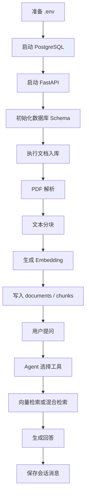
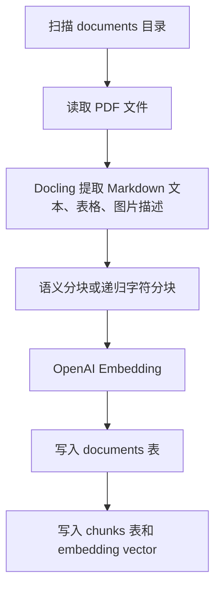
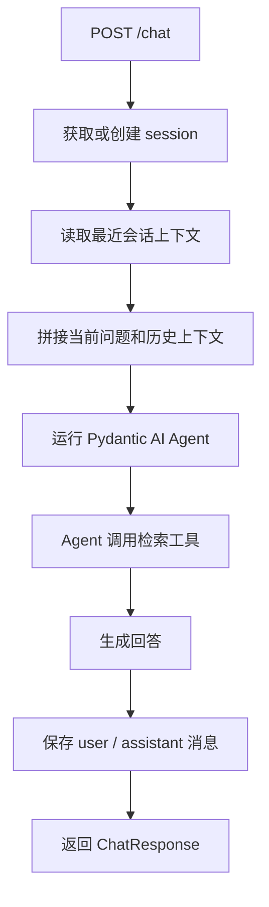

# 操作流程与触发说明

本文整理项目运行时的主要操作流程，以及每个流程由什么命令、接口或页面动作触发。

## 总览



## 1. 服务启动触发

### 本机触发

```bash
uvicorn agent.api:app --host 0.0.0.0 --port 8058 --reload
```

触发内容：

1. FastAPI 加载 `agent.api:app`。
2. 执行应用生命周期 `lifespan`。
3. 初始化 PostgreSQL 连接池。
4. 执行 `sql/schema.sql` 初始化表、索引、函数和视图。
5. 执行数据库健康检查。

### Docker 触发

```bash
docker compose up -d --build
```

触发内容：

1. 启动 `postgres` 服务。
2. 等待 PostgreSQL 健康检查通过。
3. 启动 `api` 服务。
4. 启动 `ui` 服务。

## 2. 数据库 Schema 初始化触发

触发入口：

```text
agent.api.lifespan
ingestion.ingest.DocumentIngestionPipeline.initialize
```

触发行为：

- 检查 `documents` 表是否存在。
- 如果不存在，执行 `sql/schema.sql`。
- 创建 pgvector、uuid、pg_trgm 扩展。
- 创建 `documents`、`chunks`、`sessions`、`messages` 表。
- 创建向量检索函数 `match_chunks`。
- 创建混合检索函数 `hybrid_search`。

## 3. 文档入库流程触发

### 命令触发

本机：

```bash
python -m ingestion.ingest --documents documents/ --clean
```

Docker：

```bash
docker compose exec api python -m ingestion.ingest --documents documents/ --clean
```

### 流程说明



### 关键输入

| 输入 | 来源 |
|---|---|
| PDF 文件 | `documents/` |
| 分块大小 | `--chunk-size` 或默认值 |
| 分块重叠 | `--chunk-overlap` 或默认值 |
| Embedding 模型 | `.env` 的 `EMBEDDING_MODEL` |
| OpenAI Key | `.env` 的 `OPENAI_API_KEY` |

### 关键输出

| 输出 | 位置 |
|---|---|
| 文档记录 | `documents` 表 |
| 分块记录 | `chunks` 表 |
| 向量数据 | `chunks.embedding` |
| 元数据 | `documents.metadata`、`chunks.metadata` |

## 4. 普通问答流程触发

### 接口触发

```bash
curl -X POST http://localhost:8058/chat \
  -H "Content-Type: application/json" \
  -d '{
    "message": "请总结知识库内容",
    "user_id": "user-1",
    "search_type": "hybrid"
  }'
```

### 流程说明



### 相关接口

| 接口 | 作用 |
|---|---|
| `POST /chat` | 普通非流式问答 |
| `POST /chat/stream` | SSE 流式问答 |
| `GET /sessions/{session_id}` | 查看会话信息 |

## 5. 流式问答流程触发

### 接口触发

```bash
curl -N -X POST http://localhost:8058/chat/stream \
  -H "Content-Type: application/json" \
  -d '{
    "message": "请详细解释知识库中的重点",
    "user_id": "user-1",
    "search_type": "hybrid"
  }'
```

### SSE 事件类型

| 类型 | 含义 |
|---|---|
| `session` | 返回或创建会话 ID |
| `text` | 模型增量文本 |
| `tools` | Agent 本轮使用过的工具 |
| `end` | 流式输出结束 |
| `error` | 流式处理异常 |

## 6. 检索流程触发

### 向量检索

```bash
curl -X POST http://localhost:8058/search/vector \
  -H "Content-Type: application/json" \
  -d '{
    "query": "sustainability strategy",
    "limit": 5
  }'
```

触发内容：

1. 对 query 生成 embedding。
2. 调用数据库函数 `match_chunks`。
3. 使用 pgvector cosine distance 排序。
4. 返回最相似的 chunks。

### 混合检索

```bash
curl -X POST http://localhost:8058/search/hybrid \
  -H "Content-Type: application/json" \
  -d '{
    "query": "sustainability strategy",
    "limit": 5
  }'
```

触发内容：

1. 对 query 生成 embedding。
2. 执行向量召回。
3. 执行 PostgreSQL FTS 关键词召回。
4. 按向量分数和文本分数组合排序。
5. 返回综合排序后的 chunks。

## 7. UI 操作触发

| UI 操作 | 触发行为 |
|---|---|
| 打开 `http://localhost:8501` | 加载 Streamlit 应用 |
| 点击 `Check Health` | 请求 API `/health` |
| 输入问题并发送 | 请求 API `/chat/stream` |
| 点击 `Clear Chat` | 清空 Streamlit 当前会话状态 |
| 修改侧边栏 API URL | 改变 UI 请求的 API 地址 |

## 8. 运维操作触发

| 操作 | 命令 |
|---|---|
| 查看服务状态 | `docker compose ps` |
| 查看 API 日志 | `docker compose logs -f api` |
| 查看 UI 日志 | `docker compose logs -f ui` |
| 查看数据库日志 | `docker compose logs -f postgres` |
| 重启 API | `docker compose restart api` |
| 重建服务 | `docker compose up -d --build` |
| 停止服务 | `docker compose down` |
| 清空数据库卷 | `docker compose down -v` |

