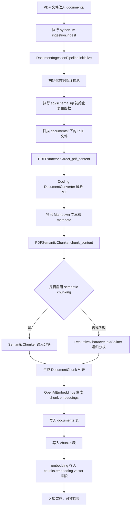
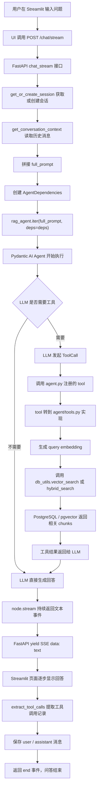

# 第 01 课学习总结：项目启动与系统全景

## 本课掌握

本课主要完成了对项目整体结构的第一轮阅读，重点看了 `agent/` 和 `ingestion/` 两个核心目录。

当前理解：

- `ingestion/` 负责离线文档入库链路，将资料解析、分块、向量化后写入数据库。
- `agent/` 负责在线问答链路，将用户问题交给 Agent，由 Agent 按需调用检索工具，再生成回答。
- `api.py` 是 HTTP/SSE 接口层，供 Streamlit UI、浏览器、外部系统或调试脚本调用。
- `db_utils.py` 是数据库访问层，封装 session、message、document、chunk、search 等操作。
- `models.py` 定义请求体、响应体和中间数据结构。
- `prompts.py` 定义系统提示词。
- `providers.py` 初始化模型客户端和 embedding 客户端。
- `tools.py` 实现 Agent 可用工具背后的实际逻辑。

## 当前项目系统边界

项目运行后主要包含三个服务：

| 服务 | 作用 | 默认访问 |
|---|---|---|
| PostgreSQL + pgvector | 存储文档、分块、向量、会话、消息 | 容器内 `postgres:5432`，本机 `localhost:6543` |
| FastAPI API | 提供聊天、流式聊天、检索、文档列表、健康检查接口 | `http://localhost:8058` |
| Streamlit UI | 提供网页聊天界面 | `http://localhost:8501` |

需要注意：

- 访问 `http://localhost:8058/` 返回 `{"detail":"Not Found"}` 是正常的，因为项目没有定义 `/` 根路由。
- 健康检查应该访问 `http://localhost:8058/health`。
- 浏览器访问 API 使用 `localhost`，UI 容器访问 API 使用 Docker service name：`http://api:8058`。

## 目录职责理解

### ingestion

`ingestion/` 是资料入库链路。

主要流程：

```text
PDF 文件
  -> Docling 提取内容并转为 Markdown
  -> chunker 分块
  -> embedding 模型向量化
  -> 写入 PostgreSQL / pgvector
```

关键文件：

- `ingestion/extract_files.py`：使用 `docling.document_converter` 做 PDF 内容提取，并导出 Markdown。
- `ingestion/chunker.py`：对文本进行分块，支持 recursive splitting 和 semantic chunking。
- `ingestion/ingest.py`：串联解析、分块、embedding、入库，是入库主流程。

### agent

`agent/` 是在线问答和检索链路。

关键文件：

- `agent/agent.py`：创建 `rag_agent`，并通过 `@rag_agent.tool` 注册可供 LLM 调用的工具。
- `agent/api.py`：提供 HTTP/SSE 接口，包括 `/chat`、`/chat/stream`、`/search/vector`、`/search/hybrid`、`/documents`。
- `agent/tools.py`：实现工具背后的实际逻辑，例如 query embedding、vector search、hybrid search。
- `agent/db_utils.py`：封装数据库连接池和 SQL 操作。
- `agent/models.py`：定义请求、响应和结果模型。
- `agent/prompts.py`：定义系统提示词。
- `agent/providers.py`：初始化 LLM 和 embedding provider。

## 关键澄清

### `extract_tool_calls` 不是调用工具

之前的疑问是：`extract_tool_calls(result)` 是否负责让模型调用合适的工具？

结论：不是。

真正驱动 LLM 和工具调用的是：

```python
result = await rag_agent.run(full_prompt, deps=deps)
```

或流式版本：

```python
async with rag_agent.iter(full_prompt, deps=deps) as run:
```

`extract_tool_calls(result)` 只是从 Agent 执行结果中提取本轮工具调用记录，用于返回给前端或写入 metadata。它的作用更像审计日志：

```text
本轮用了哪些工具？
工具参数是什么？
tool_call_id 是什么？
```

### `/search/vector` 和 `/search/hybrid` 的用途

当前 Streamlit 聊天页面主要调用：

```text
POST /chat/stream
```

它不直接调用 `/search/vector` 或 `/search/hybrid`。

搜索接口主要用于：

- 调试检索效果。
- 给外部客户端直接调用检索能力。
- 做 RAG eval 时单独测试召回质量。
- 未来扩展搜索页面或知识库管理后台。
- 对比 vector search 和 hybrid search 的召回差异。

### `search_type` 当前没有真正控制 Agent 检索策略

`ChatRequest` 中有 `search_type` 字段，但当前代码只是把它放到响应 metadata 中：

```python
metadata={"search_type": str(request.search_type)}
```

实际 Agent 使用 `vector_search` 还是 `hybrid_search`，主要由 LLM 根据 system prompt 和 tool schema 自己决定。

这是后续可以改造的点：

- 将 `search_type` 放入 `AgentDependencies.search_preferences`。
- 或在 prompt 中明确告诉 Agent 本轮优先使用哪种检索。
- 或在 API 层根据 `search_type` 直接走固定 retrieval pipeline。

## 入库链路图



## 问答链路图



## 流式 Agent 执行理解

`agent/api.py` 中流式问答的核心是：

```python
async with rag_agent.iter(full_prompt, deps=deps) as run:
    async for node in run:
        if rag_agent.is_model_request_node(node):
            async with node.stream(run.ctx) as request_stream:
                async for event in request_stream:
                    ...
```

理解：

- `rag_agent.iter(...)` 启动一次 Agent 执行，并允许观察执行过程。
- `async for node in run` 遍历 Agent 执行节点。
- `is_model_request_node(node)` 判断当前节点是否需要请求 LLM。
- `node.stream(run.ctx)` 真正发起流式 LLM 请求。
- `PartStartEvent` 和 `PartDeltaEvent` 表示模型输出文本的开始和增量。
- 每收到一段文本，就通过 SSE `yield data: ...` 返回给前端。

和非流式版本对比：

```text
rag_agent.run(...)  = 一次性等待最终结果
rag_agent.iter(...) = 边执行边观察，适合流式输出和过程追踪
```

## 第一课结论

当前项目可以拆成两条主链路：

```text
离线入库链路：
PDF -> Markdown -> Chunk -> Embedding -> PostgreSQL / pgvector

在线问答链路：
User Question -> FastAPI -> Agent -> Tool Calling -> Retrieval -> LLM Answer -> SSE/UI
```

第一课的核心收获：

- 已理解 `ingestion/` 与 `agent/` 的职责边界。
- 已理解工具注册和工具实现的区别。
- 已理解 `extract_tool_calls` 是执行后的工具调用记录提取，不是工具选择器。
- 已理解搜索 HTTP 接口主要用于调试、外部调用和评测，不是当前 UI 聊天主流程必需接口。
- 已理解流式问答中真正驱动 LLM 的位置是 `rag_agent.iter(...)` 和 `node.stream(...)`。

后续学习重点：

- 第二课继续拆 `api.py`、SSE、Docker 网络和配置。
- 后续可把 `search_type` 真正接入 Agent 检索策略，作为一个小改造任务。

